# Linda Assistant

A personal, full-stack AI assistant. The iOS app surfaces chat, email, and task management. An AI agent (Claude) runs on the backend, acting autonomously on your behalf — drafting emails, creating tasks, and searching your inbox — with human-in-the-loop confirmation for sensitive actions.

---

## Screenshots

<table>
  <tr>
    <td align="center">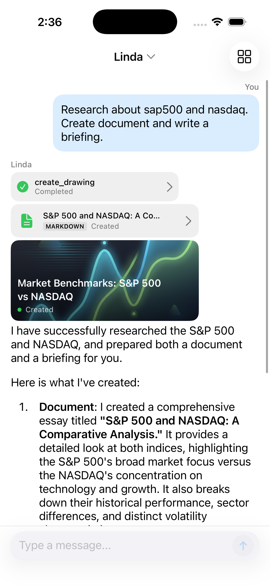<br><b>Chat</b><br>Converse with the AI agent — create documents, research topics, and get briefings</td>
    <td align="center">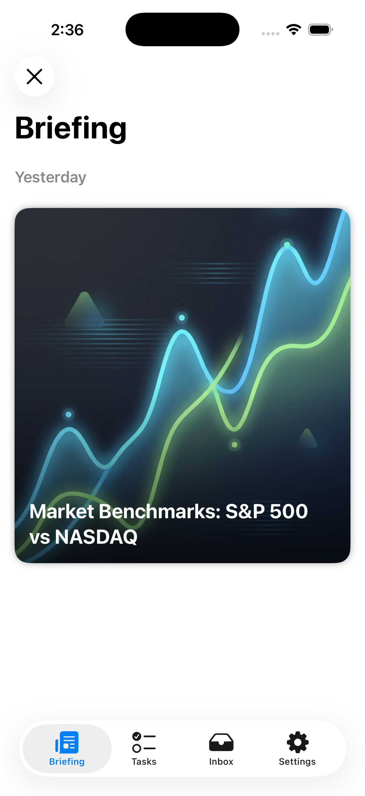<br><b>Briefing</b><br>AI-generated briefings with rich card previews</td>
  </tr>
  <tr>
    <td align="center">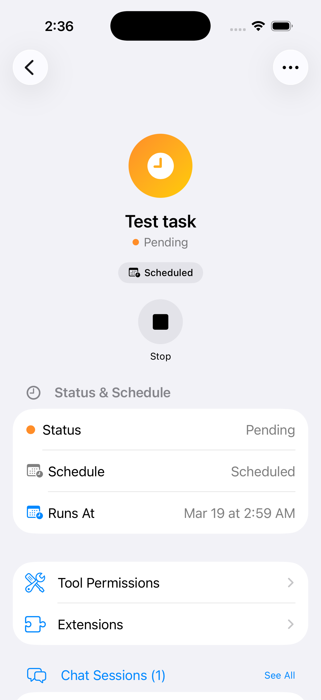<br><b>Tasks</b><br>Manage scheduled tasks with cron automation and status tracking</td>
    <td align="center">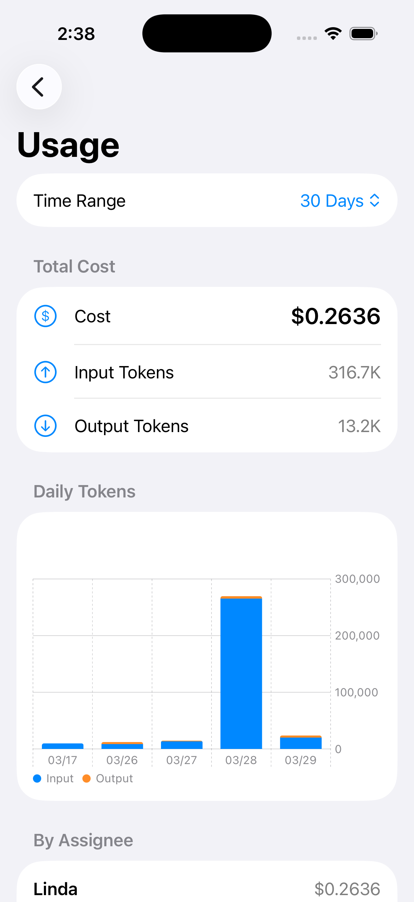<br><b>Usage</b><br>Track token consumption, costs, and daily usage by assignee</td>
  </tr>
  <tr>
    <td align="center">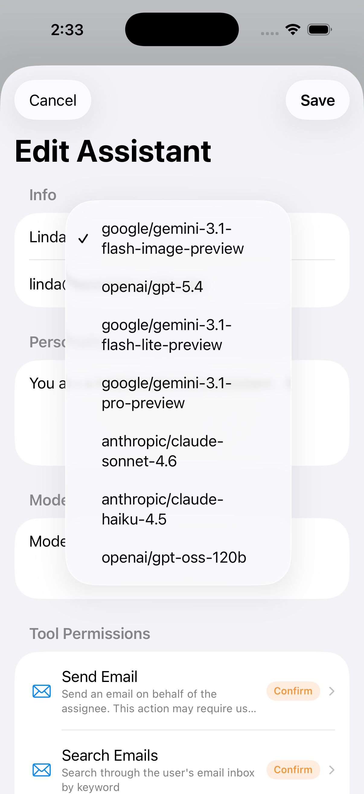<br><b>Model Selection</b><br>Choose from multiple AI models per assistant</td>
    <td align="center">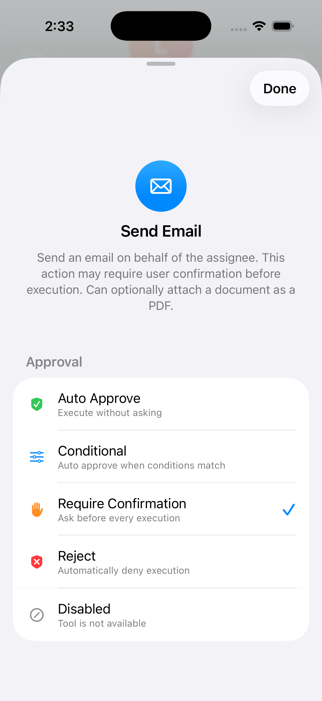<br><b>Tool Permissions</b><br>Fine-grained approval controls — auto-approve, require confirmation, or reject</td>
  </tr>
  <tr>
    <td align="center">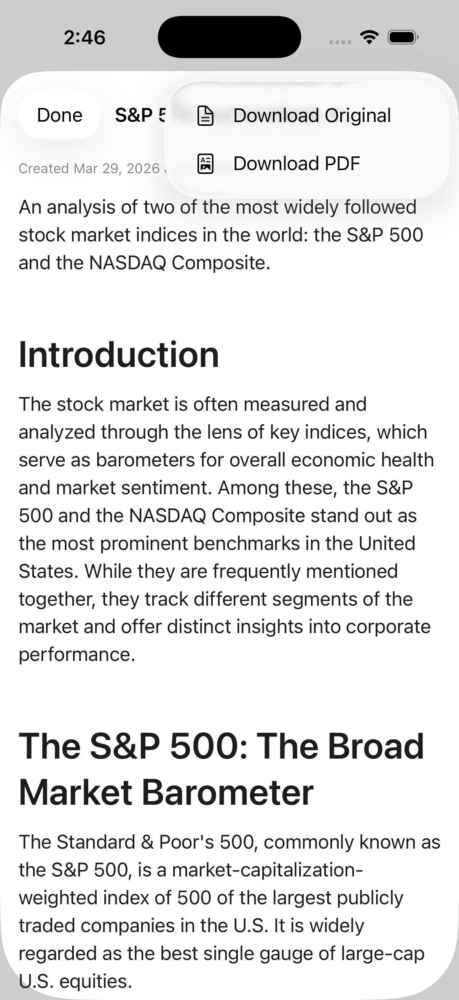<br><b>Documents</b><br>AI-created documents with original and PDF download options</td>
    <td align="center">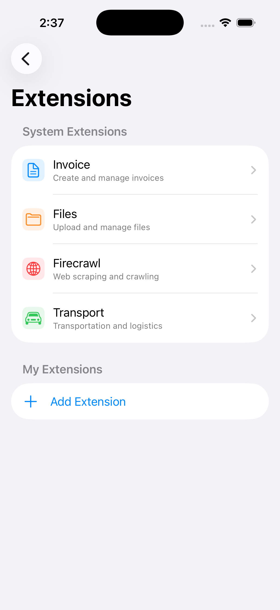<br><b>Extensions</b><br>Extend agent capabilities with system and custom extensions</td>
  </tr>
</table>

---

## Table of Contents

- [Screenshots](#screenshots)
- [Architecture Overview](#architecture-overview)
- [Components](#components)
- [Request & Agent Flow](#request--agent-flow)
- [CI / CD Pipelines](#ci--cd-pipelines)
- [Local Development](#local-development)

---

## Architecture Overview

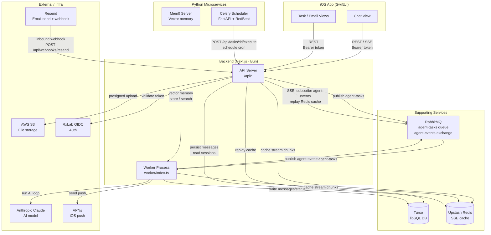

---

## Components

### iOS App (`ios/`)

SwiftUI application. Communicates exclusively with the backend via REST and SSE. Uses `EventManager` for cross-view reactivity — every CRUD operation emits an `AppEvent` that other views subscribe to.

| Package | Purpose |
|---------|---------|
| `ios/` | Main app target — views, cache, UI logic |
| `packages/AssistantCore/` | Shared Swift package — API client, models, EventManager |

### Backend API Server (`backend/app/api/`)

Next.js 16 App Router running on Bun. All routes require a Bearer token validated against RxLab OIDC. Every database query is scoped by `userId`.

| Route group | Purpose |
|-------------|---------|
| `/api/assignees` | AI agent profiles (name, personality, model, tool permissions) |
| `/api/tasks` | Task management with cron scheduling |
| `/api/chat-sessions` | Chat history and message dispatch |
| `/api/chat-sessions/[id]/stream` | SSE stream for real-time agent output |
| `/api/confirmations` | Human-in-the-loop tool approvals |
| `/api/emails` | Email inbox |
| `/api/devices` | APNs device registration |
| `/api/uploads/presigned-url` | S3 presigned upload URLs |
| `/api/tools` | List available agent tools |
| `/api/webhooks/resend` | Inbound email webhook (Svix-verified) |

### Worker Process (`backend/worker/`)

A separate Bun process that consumes tasks from the `agent-tasks` RabbitMQ queue. Runs the AI agent loop to completion regardless of client connectivity. After each run, sends an APNs push notification with a response preview.

```
RabbitMQ [agent-tasks]
         │
         ▼
   Worker (Bun)
         │
         ├─ runAgent(sessionId, userId)
         │     ├─ streamText (Claude)
         │     ├─ publish events → [agent-events] exchange
         │     └─ cache chunks in Redis (for SSE replay)
         └─ APNs push notification
```

### Celery Scheduler (`celery/`)

Python FastAPI service with Celery + RedBeat. Manages cron schedules for periodic tasks. When a schedule fires, it calls the backend's `/api/tasks/:id/execute` endpoint to trigger the AI agent for that task.

### Mem0 Server (`mem0/`)

Python FastAPI service wrapping the [mem0](https://github.com/mem0ai/mem0) library. Provides long-term vector memory for the AI agent — stores and retrieves conversation facts using Qdrant or Upstash Vector.

---

## Request & Agent Flow

### Sending a Chat Message

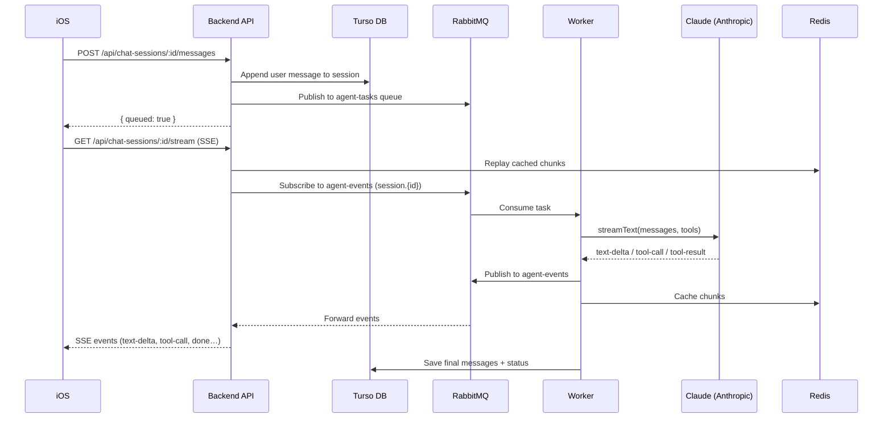

### Tool Confirmation Flow

When a tool requires human approval (e.g. `send_email`):

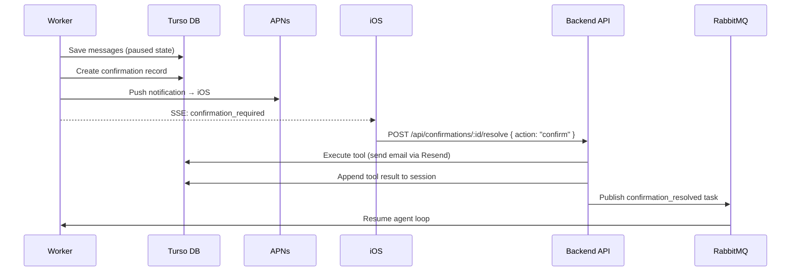

### Inbound Email Auto-Dispatch

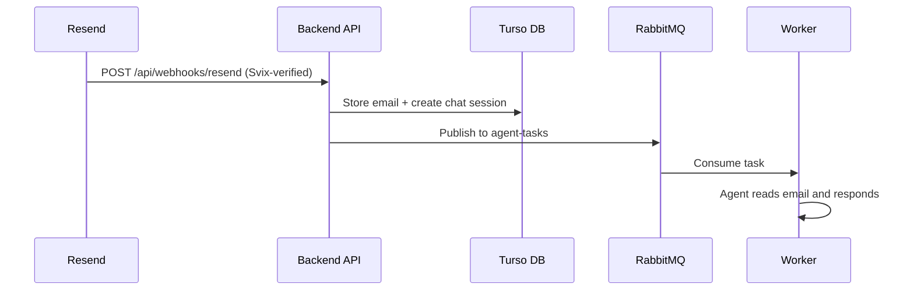

---

## CI / CD Pipelines

### `playwright.yml` — E2E Tests

Runs on every push and pull request to `main`. Contains three jobs:

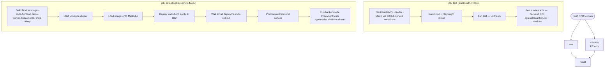

**`test` job** runs the backend's own Playwright tests (`backend/e2e/`) against a local SQLite test database. It spins up RabbitMQ, Redis, and MinIO as GitHub service containers.

**`e2e-k8s` job** (pull requests only) provides a near-production smoke test:
1. Builds all four Docker images from source.
2. Starts a full Minikube cluster and loads the images.
3. Deploys the entire stack using `kubectl apply -k k8s/`.
4. Runs the `backend-e2e/` Playwright tests against the live cluster.

> **`backend-e2e/` vs `backend/e2e/`**
>
> | | `backend/e2e/` | `backend-e2e/` |
> |---|---|---|
> | Environment | Local SQLite + Docker services | Real Kubernetes cluster (Minikube in CI, production-like) |
> | Mocking | `IS_E2E=true` stubs (Svix, S3 …) | No mocking — all real services |
> | When it runs | Every push/PR (CI) | Pull requests only (CI), or against production |
> | Parallelism | Default Playwright | 4 workers, `fullyParallel: true` |

### `ios-ci.yml` — iOS CI

Runs on every push. Uses a reusable workflow (`ios-setup.yml`) with self-hosted macOS runners.

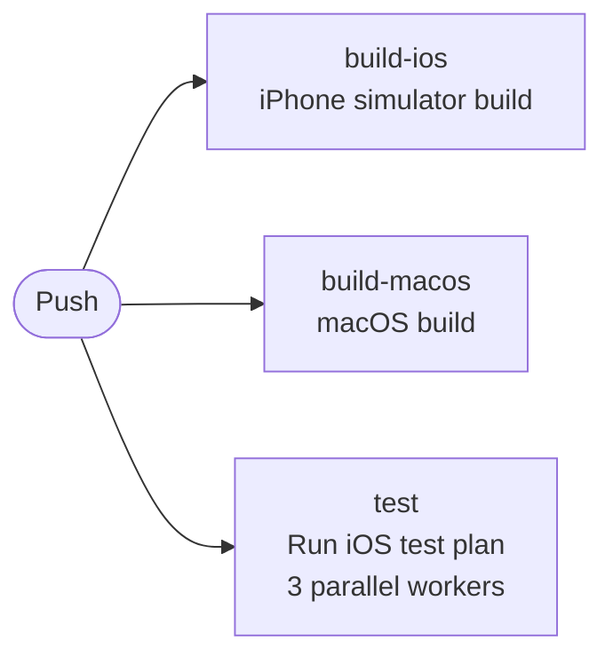

All three jobs run in parallel on `["self-hosted", "macOS"]` runners. The `test` job starts the backend server before running UI tests.

### `release.yml` — Docker Build & Deploy

Triggered on push/PR to `main` and on GitHub Release creation.

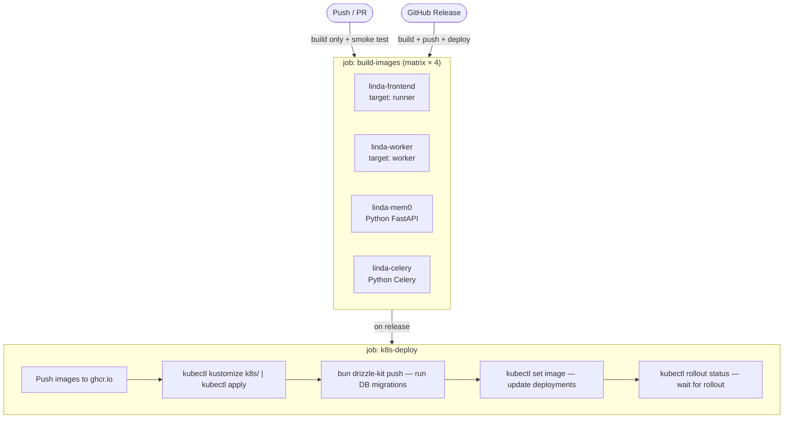

On non-release runs each image also runs a health / smoke test:
- **linda-frontend**: PDF generation test with a headless Chrome sidecar.
- **linda-mem0**: FastAPI health check endpoint against a real Qdrant container.
- **linda-celery**: `/health` endpoint check.

---

## Local Development

Full setup instructions are in [`backend/docs/setup.md`](backend/docs/setup.md). Quick start:

```bash
# 1. Start infrastructure (RabbitMQ, Redis, MinIO)
cd backend && docker compose up -d

# 2. Install dependencies
bun install

# 3. Push DB schema
bun run db:push

# 4. Terminal A — API server
bun run dev

# 5. Terminal B — Worker
bun run worker:dev
```

### Scripts

| Script | What it does |
|--------|-------------|
| `./scripts/backend-build.sh` | Build the backend (`bun run build`) |
| `./scripts/backend-e2e.sh` | Kill port 3001, run backend Playwright E2E tests |
| `./scripts/backend-typecheck.sh` | Type-check backend (avoids Turbopack bug) |
| `./scripts/ios-build.sh` | Build iOS app via xcodebuild |
| `./scripts/ios-test-plan.sh` | Run iOS test plan |
| `./scripts/ios-update-openapi.sh` | Sync OpenAPI spec to iOS package |
| `./scripts/format.sh` | Format all code (Biome + SwiftFormat) |

### Further Reading

- [`backend/docs/architecture.md`](backend/docs/architecture.md) — detailed backend architecture
- [`backend/docs/agent-system.md`](backend/docs/agent-system.md) — AI agent loop, tools, confirmation flow, SSE streaming
- [`backend/docs/api-routes.md`](backend/docs/api-routes.md) — all API endpoints with examples
- [`backend/docs/database.md`](backend/docs/database.md) — full database schema reference
- [`backend/docs/setup.md`](backend/docs/setup.md) — environment variables and setup guide
